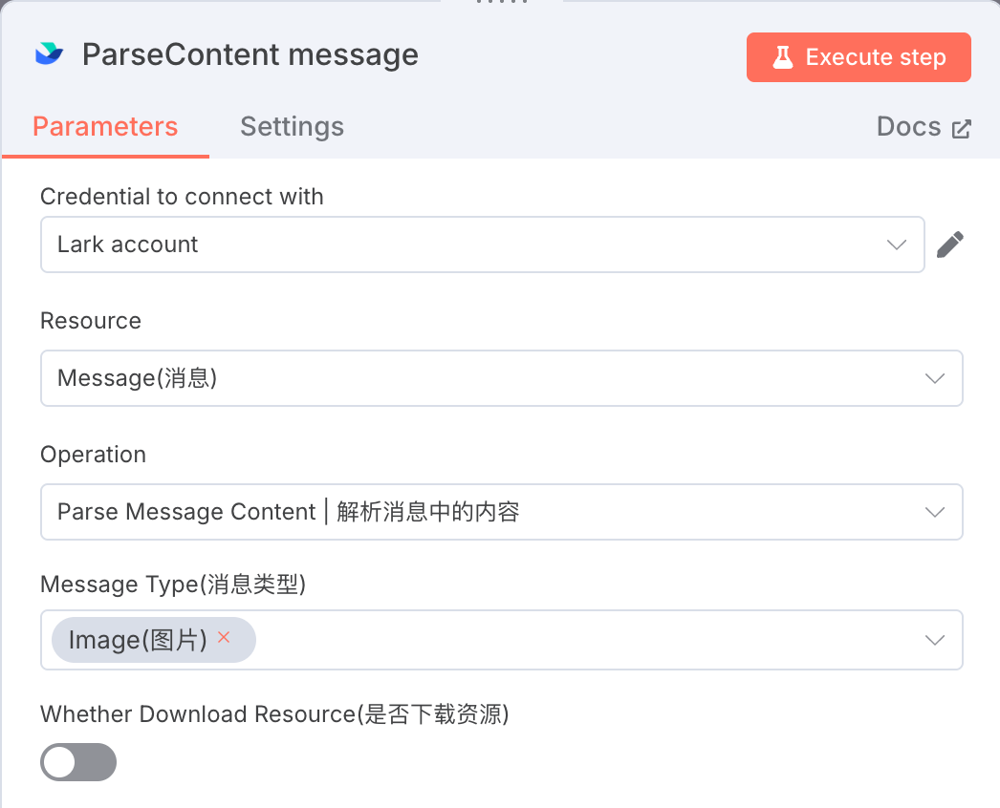

[English](https://github.com/zhgqthomas/n8n-nodes-feishu-lark/blob/main/README-EN.md)

# n8n-nodes-feishu-lark

本项目是基于 [n8n-nodes-feishu-lite](https://github.com/other-blowsnow/n8n-nodes-feishu-lite) 之上进行的二次开发，感谢原作者的开源贡献。在原有功能基础上，增加了更多实用的节点类型和功能支持。

与原项目最大的差别是添加了 [LarkTigger](https://github.com/zhgqthomas/n8n-nodes-feishu-lark/blob/main/README.md#trigger-node-%E4%BD%BF%E7%94%A8%E8%AF%B4%E6%98%8E) 和 `LarkMCP` 节点 

## 安装教程

参考：https://docs.n8n.io/integrations/community-nodes/installation/

节点名称：`n8n-nodes-feishu-lark`

## 节点类型

本项目提供了以下三种类型的节点：

### 1. Lark Node（飞书节点）

主要的飞书 API 操作节点，支持各种飞书 OpenAPI 功能调用。

### 2. Lark Trigger Node（飞书触发器节点）

飞书事件触发器节点，通过长连接方式接收飞书事件推送。

### 3. Lark MCP Node（飞书 MCP 节点）

支持 Model Context Protocol (MCP) 的飞书集成节点。

## Trigger Node 使用说明

### 特点

- **长连接方式**：采用 WebSocket 长连接技术，无需公网 IP 和域名即可建立连接
- **实时事件推送**：支持实时接收飞书各类事件推送
- **免配置**：无需复杂的网络配置，开箱即用

### 基本使用方法

1. **添加 Trigger Node**：在工作流中添加 "Lark Trigger" 节点

2. **配置凭据**：选择已配置的飞书 API 凭据
3. **选择事件类型**：根据需要选择要监听的事件类型
4. **启动工作流**：保存并启动工作流，节点将自动建立长连接

手动点击`Execte Workflow`,会开启长链接模式，但是在监听到一次事件之后，就会断开。想要一直保持链接模式，设置整个工作流为 `active` 状态，就会一直建立连接。切换为 `inactive` 的话，就会中断连接。
### 支持的事件类型
- **消息事件**：新增消息、消息表情回复、接收消息
- **多维表格事件**：字段变更、记录变更等
- **卡片交互事件**：卡片回传交互等
- **任意事件**：支持监听所有事件类型

具体有哪些事件以及对应的 Payload，请查看飞书官方网站进行了解。[点击此链接跳转](https://open.feishu.cn/document/server-docs/event-subscription-guide/event-list)

### 解析消息内容组件
跟飞书机器人最多的交互一般都是通过聊天框发指令给机器人，因此特意开发了一个解析消息内容的组件
Resource 选择 Message， Operation 选择 Parse Message Content 就可以使用该组件

### Trigger 和 解析组件搭配 Demo
Trigger 选择监听接收消息，然后搭配解析组件就可以实现在飞书客户端给机器人发一张图片，然后将图片传递给 Chatgpt 进行 OCR 分析等工作流。[点击这里跳转到Demo](https://github.com/zhgqthomas/n8n-nodes-feishu-lark/blob/main/demo/send_image_lark_bot_analyze.json)

## MCP 的使用
请先参考开源项目[n8n-nodes-mcp](https://github.com/nerding-io/n8n-nodes-mcp/blob/main/README.md)的使用介绍，后续会出更详细的使用说明。

## 实现的飞书 OpenAPI 功能

### 知识库相关

- 获取知识空间列表
- 获取知识空间信息
- 更新知识空间设置
- 删除知识空间成员
- 获取知识空间成员列表
- 添加知识空间成员
- 更新知识空间节点标题
- 移动知识空间节点
- 获取知识空间节点信息
- 获取知识空间子节点列表
- 创建知识空间节点
- 创建知识空间节点副本

### 通讯录相关

- 获取用户信息
- 通过手机号或邮箱获取用户 ID

### 任务相关

- 更新任务
- 获取任务详情
- 删除任务
- 创建任务
- 移除任务成员
- 添加任务成员

### 电子表格相关

- 修改电子表格属性
- 获取电子表格信息
- 创建电子表格
- 获取工作表
- 删除工作表
- 复制工作表
- 新增工作表
- 查询工作表
- 更新行列
- 移动行列
- 插入行列
- 删除行列
- 增加行列
- 拆分单元格
- 设置单元格样式
- 替换单元格
- 合并单元格
- 查找单元格
- 写入数据
- 读取单个范围
- 插入数据
- 写入图片
- 自动写入数据
- 追加数据

### 云空间相关

- 上传素材
- 上传素材通过 URL

### 消息相关

- 发送消息
- 回复消息
- 撤回消息
- 转发消息
- 编辑消息
- 批量发送消息
- 批量撤回消息

### 云文档相关

- 获取文档纯文本内容
- 获取文档基本信息
- 获取文档所有块
- 创建文档
- 更新块的内容
- 删除块
- 创建块
- 创建嵌套块

### 日历相关

- 搜索日历
- 查询日历信息
- 查询主日历信息
- 删除共享日历
- 创建共享日历
- 更新日程
- 搜索日程
- 获取日程列表
- 获取日程
- 删除日程
- 创建日程
- 获取日程参与人列表
- 删除日程参与人
- 添加日程参与人
- 解绑会议群
- 创建会议群

### 多维表格相关

- 解析多维表格地址
- 更新多维表格元数据
- 获取多维表格元数据
- 创建多维表格
- 复制多维表格
- 更新数据表
- 列出数据表
- 删除数据表
- 新增数据表
- 更新视图
- 列出视图
- 获取视图
- 删除视图
- 新增视图
- 更新记录
- 查询记录
- 查询记录-通过记录ID
- 删除记录
- 批量更新记录
- 批量删除记录
- 批量新增记录
- 新增记录
- 新增字段
- 保存字段
- 列出字段
- 删除字段
- 批量保存字段

### 授权相关

- 获取当前应用 AccessToken

## 许可证

MIT License

## 贡献

欢迎提交 Issue 和 Pull Request 来帮助改进这个项目。

## 链接

- [项目主页](https://github.com/zhgqthomas/n8n-nodes-lark-feishu)
- [飞书开放平台文档](https://open.feishu.cn/document/)
- [n8n 社区节点文档](https://docs.n8n.io/integrations/community-nodes/)
